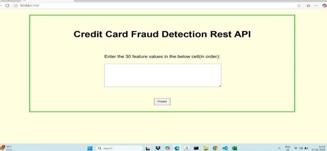
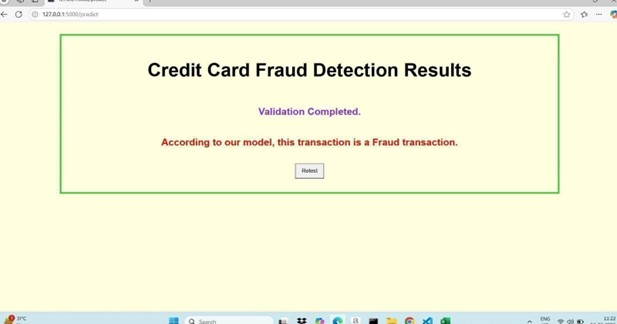
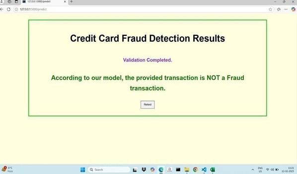

# 🔐 Fraud Detection Web Application

A smart and scalable Flask web application that predicts **fraudulent transactions** using pre-trained machine learning models for both **Credit Card** and **UPI (Unified Payments Interface)** operations.

This project combines:
- A clean Flask UI
- Pre-trained ML models (`.pkl`)
- Robust backend logic
- Custom error handling and testing

---

## 🚀 Features

✅ Predict **Credit Card fraud** based on transaction vectors  
✅ Detect **UPI frauds** using withdrawal, deposit, and balance inputs  
✅ Input validation and user-friendly error messages  
✅ Integrated model loading with fallbacks  
✅ Clean and testable modular code  
✅ Easy deployment-ready with `gunicorn`

---

## 📁 Project Structure

📦 FraudDetectionApp/
├── app.py # Flask web application  
├── test_models.py # Model testing script  
├── requirements.txt # Python dependencies  
├── models/  
│ ├── credit_card_model.pkl  
│ └── upi_model.pkl  
├── templates/  
│ ├── index.html  
│ ├── credit.html  
│ ├── upi.html  
│ └── result.html  

---

## 💡 How It Works

### 📌 Credit Card Fraud
- User enters features (comma-separated values)
- Model predicts if the transaction is **fraudulent** or **safe**

### 📌 UPI Fraud
- User provides:
  - `Withdrawal amount`
  - `Deposit amount`
  - `Final balance`
- Model predicts likelihood of **fraud**

---

## 🧪 Testing Models

Run the included script to verify model predictions:

python test_models.py

This loads both models and performs predictions on sample data.

🛠️ Setup Instructions  
1.Clone the repo  
    git clone https://github.com/<your-username>/fraud-detection-flask.git   
    cd fraud-detection-flask 
    
2.Install dependencies  
    pip install -r requirements.txt  
    
3.Run the app  
    python app.py  
    
4.Or deploy with Gunicorn  
    gunicorn app:app 
    
5.Visit  
    http://localhost:5000/  

🧠 Model Inputs  
Model	Input Format	Example  
Credit Model	Comma-separated float values	0.5, 1.2, 3.4, 0.1  
UPI Model	Withdrawal, Deposit, Balance (numeric)	Withdrawal=100, Deposit=200, Balance=1500  

Make sure .pkl model files are in the /models folder.

🧪 Requirements  
All dependencies are listed in requirements.txt, including:

Flask  
NumPy  
Joblib  
Gunicorn  
Scikit-learn  
Others (TensorFlow, Keras, etc.)  

pip install -r requirements.txt

⚠️ Notes  
Model files are expected to be in: ./models/credit_card_model.pkl and ./models/upi_model.pkl

Frontend templates must be in the templates/ folder

Uses render_template() for dynamic HTML pages

🧑‍💻 Author  
Vasavi

📧 Email: vasavi9354@gmail.com

📃 License  
This project is licensed under the MIT License.
Feel free to use, modify, and distribute for educational or production purposes.

## 📊 Results

### Web Interface for Submitting Feature Inputs to Fraud Detection Model

### Output Interface of the Credit Card Fraud Detection System Indicating a Fraudulent Transaction

### Output Interface of the Credit Card Fraud Detection System Indicating a Fraudulent Non-Transaction

